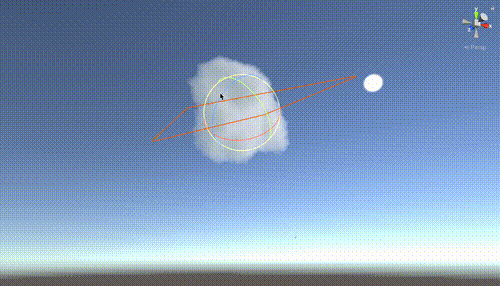

# Imposter-cloud-
Imposter cloud rendered 

This is a sample of cloud rendering achieved through the advanced impostor method, utilizing an atlas created within Houdini. This experimental test blends several technical methodologies to push the visual quality and performance.

Our approach synergizes the occlusion parallax method with the Octahedral Impostor technique, culminating in a stylized cloud rendering. For an in-depth exploration of the technicalities and access to the source code, visit my blog.

Stay tuned for more updates as I continue to refine this experimental fusion.

https://aysebin.top/index.php/archives/353.html
https://www.aysebin.top/index.php/archives/325.html
